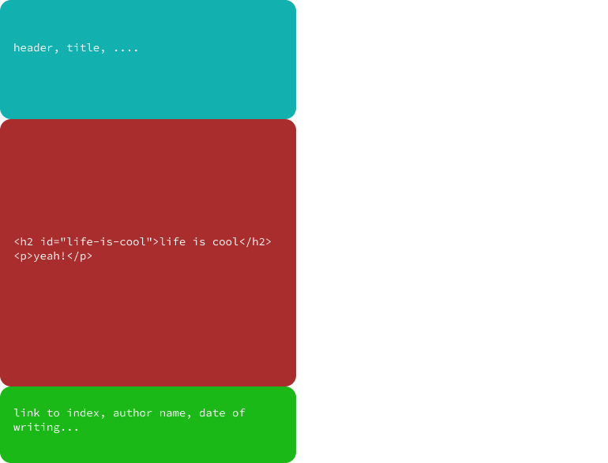
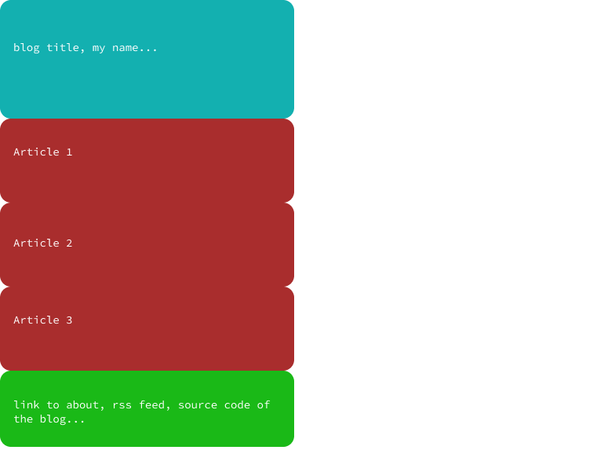

## Objective 

when I created this blog, I had some objectives, I wanted a blog:

- open source 
- without any JS line
- using markdown
- with a RSS feed

for this I used python (originally I had planned to use C++ but python simplifies the task a lot).

## Why ?

I created this blog, to learn how to generate code for a site in python, to get back into python (it's been 3 years since I last wrote python seriously), because I wanted to learn and have control over how the site is generated.

## Markdown to html file conversion

for the conversion of markdown files to html I used pandoc (with pypandoc).

So, to begin with I convert the markdown file to an html file like this:

```python
pypandoc.convert_file(markdown_file_path, 'html', format='md')
```

For example for markdown code like this:
```md
## life is cool
yeah! 
```

I would have a pandoc result like this :
```html
<h2 id="life-is-cool">life is cool</h2>
<p>yeah!</p>
```

Which is a base for the blog page. Then we need to add html and css code for each page.

This is what the result may look like:



So each html file contains the 'top template' the 'markdown code' and the 'bottom template'.

For the moment the creation of the page looks like this: First we open the output file, we write the top template, then we write the markdown html code generated, and so to finish we write the bottom template.

However we need to configure an article, for example how the blog generator can know the name of the article ? the name of the person who wrote it, the date of writing ... ?

## Article configuration

For each article there is a configuration file (which has the same name but has a .conf instead of the .md, so for `hello.md` I would have the config file: `hello.conf` )

configuration example: 

*(note: later I may put json instead of .conf files)*

```conf
[info]
author = supercyp
date = 26 May 2021
title = this is the post title
resume = this is the resume of the article
```

I also use the config file to modify parts of the TOP/BOTTOM TEMPLATE. So for example in the template all `{{date}}` will be replaced by the date put in the config file.

so the code: 
```html
<h5>
    written by {{writer}} on {{date}}
</h5>
```

will be replace to:

```html
<h5>
    written by supercyp on 26 May 2021
</h5>
```

It allows to avoid repeated code and to simplify article writing.

note: a configuration file is also used for index.html but I will talk about it later.

So for each item, the generator uses this structure: 

```py
title: str
writer: str
date: str
path: str
path_ex: str
resume: str
```

`path`: the html path relative to create_website.py (./build/post.html)

`path_ex`: the html path relative to the final website (./post.html)

## the central page of the blog

The page that lists all the articles is structured differently from all the others pages. 



At each construction of an article page, we add its information to a table, then during the creation of the `index.html` file, we read the table and we use (for each entry) an ARTICLE_ENTRY_TEMPLATE.
for the moment it looks like this:

```html
<div class="article_entry">
    <h1>
        {{title}}
    </h1>
    <h5>
        written on {{date}}
    </h5>
    <h3>
        {{resume}}
    </h3>
    <a href="./{{path}}">read more</a>
</div>
```
the generator will fill each information (like: `{{resume}}`, `{{date}}`..) with the article that is in the table entry.
(note: {{path}} is the link to the article)

there is also a page-specific 'TOP/BOTTOM TEMPLATE' for the index that uses the configuration file `blog_conf.conf` for the blog name, link to the about page...

## Asset management

the management of assets is very simple: during the creation of the blog, all the files in assets are copied into the assets file of the build.

The 'asset' file contains: css files and pictures.

## RSS management

For the rss feed I used `rfeed`, I create each post of the feed with the same information given to the index for the creation of the article list (name, summary, link, ...)

## Conclusion

Here is a short summary of how I generate this website, I do not think it is perfect and if there is a problem do not hesitate to make an issue or pr! Also, I don't think the code is the best in the world but if you want to have a look don't hesitate. 